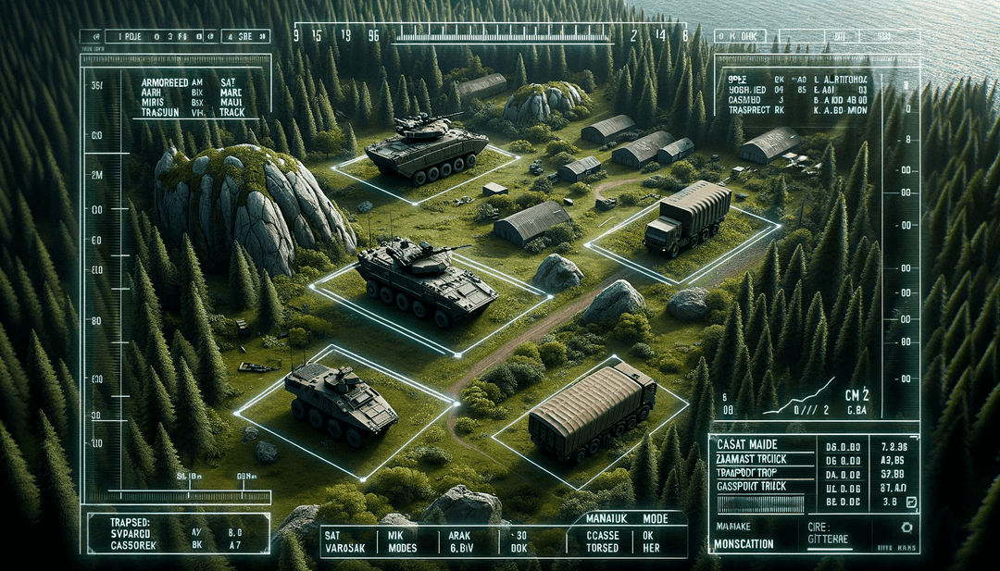
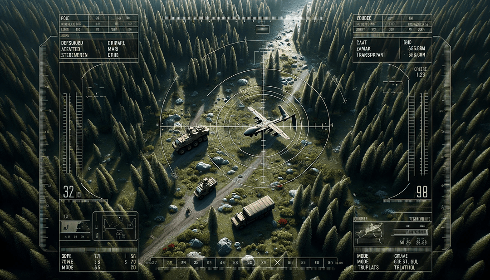
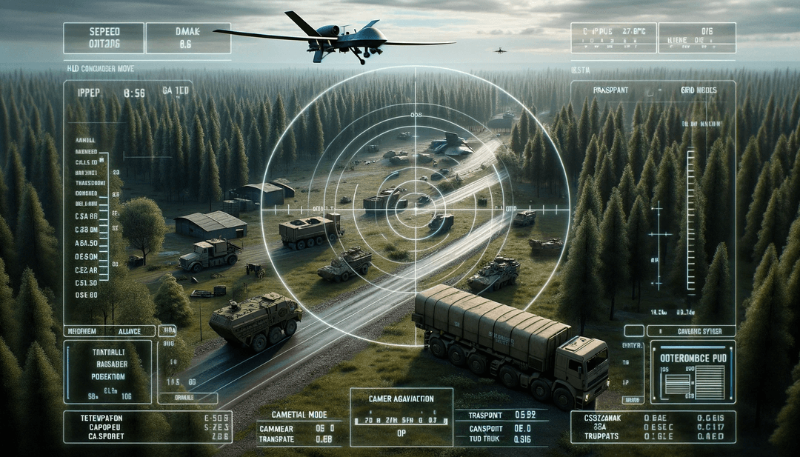

# SkySight Military Monitor: YOLOv5 for Military Vehicles Detection

This project presents an advanced solution for detecting military vehicles in aerial imagery from the ARMA 3 simulation environment. Utilizing the cutting-edge capabilities of YOLOv5, this model is fine-tuned to recognize specific military vehicles under various conditions, demonstrating the power of computer vision in military applications.

  

  

  

  

Explore our project's development journey and insights through our case study and tutorial:

Coming Soon

## Model Capabilities

Our YOLOv5 model has been meticulously fine-tuned using a dataset of 300 images, featuring 100 images for each class. The images encompass various environments, angles, and lighting conditions, captured at noon with clear skies using a UAV at approximately 100 meters altitude. 

The model proficiently identifies the following classes with high accuracy and speed:

- Main Battle Tank
- Infantry Fighting Vehicle
- Transport Truck

## Installation and Usage

To deploy this model in your environment, follow these steps:

1. **Clone the Repository:**

    To clone the repository, use the following command:

    git clone git@github.com:vaheaslanyangit/SkySight-Military-Monitor.git

2. **Prepare Your Images:**

Add the images you want to analyze into the input folder. The model is optimized for aerial imagery and can handle a variety of military vehicle types and terrains.

3. **Run the Model**

Execute the following command to start the detection process:

    python detect.py --source ./input/ --weights runs/train/yolo_arma4/weights/best.pt --conf 0.5 --name yolo_arma

4. **Visualize the Results**

The detection results will be stored in the runs/detect/yolo_armaX folder. Review the output images and videos to see the model's performance in action.

**Technical Details**

The project leverages the YOLOv5 algorithm, renowned for its balance between speed and accuracy, making it suitable for real-time detection in military and surveillance applications. The model's architecture is optimized for handling dynamic conditions, including varying camera angles, altitudes, and lighting environments encountered in aerial surveillance.

**Future Enhancements**

We are continually working on improving the model's capabilities, including expanding the range of detectable vehicle types and enhancing its performance under diverse operational scenarios. Stay tuned for future updates and advancements in this project.
