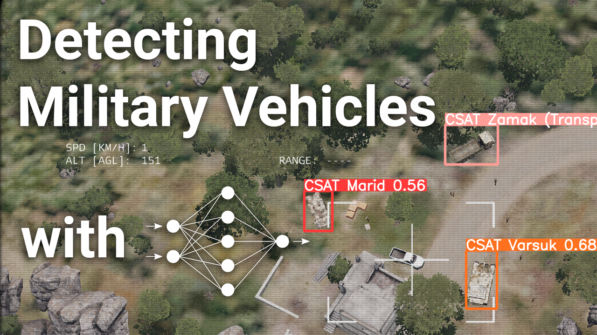

# Military Vehicles Image Recognition: Enhanced YOLOv5 for Aerial ARMA 3 Imagery

This project presents an advanced solution for detecting military vehicles in aerial imagery from the ARMA 3 simulation environment. Utilizing the cutting-edge capabilities of YOLOv5, this model is fine-tuned to recognize specific military vehicles under various conditions, demonstrating the power of computer vision in military applications.

<p align="center">
  
</p>

<p align="center">
  
</p>

Explore our project's development journey and insights through our Youtube devlog:
<p align="center">
  <a href="https://youtu.be/DKLcZ7jMpyU" target="_blank">
    
  </a>
</p>

## Model Capabilities

Our YOLOv5 model has been meticulously fine-tuned using a dataset of 300 images, featuring 100 images for each class. The images encompass various environments, angles, and lighting conditions, captured at noon with clear skies using a UAV at approximately 100 meters altitude. 

The model proficiently identifies the following classes with high accuracy and speed:
- CSAT Varsuk
- CSAT Marid
- CSAT Zamak (Transport)

The comprehensive dataset used for training is publicly available on [Kaggle](https://www.kaggle.com/datasets/alexandresajus/arma3cvdataset).

## Installation and Usage

To deploy this model in your environment, follow these steps:

1. **Clone the Repository:**

   ```bash
   git clone https://github.com/AlexandreSajus/Military-Vehicles-Image-Recognition.git
